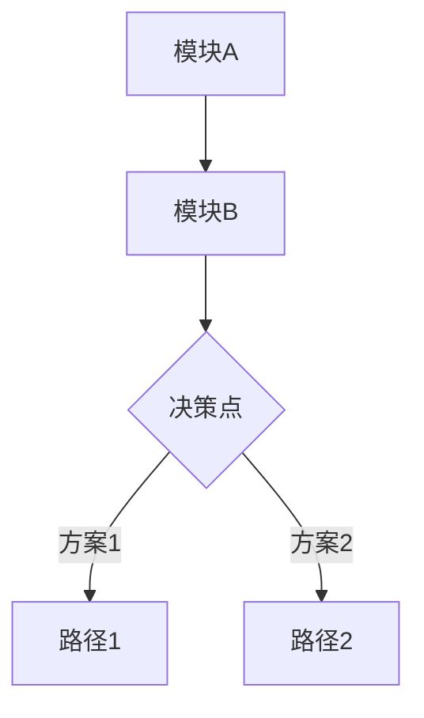

# Grill Me — 结构化设计面试

无情地追问方案的每个决策分支，直到达成共识。沿决策树逐条下行，逐一解决决策间的依赖关系。

## 核心规则

### 1. 先探索，再追问

**问用户之前，穷尽代码库和历史记忆。**

启动时**并行执行**以下探索：

```
并行探索清单：
├─ Agent(subagent_type="Explore") → 全面扫描相关模块和代码上下文
├─ Grep/Glob                     → 特定模式、文件结构
├─ LSP (documentSymbol等)        → 符号级代码智能
├─ mcp__cloud_brain__cb_retrieve_memories → 过往决策、项目经验
├─ mcp__note__search_wiki        → 知识库中相关页面
└─ Read                          → 关键文件的具体实现
```

判断规则：
- 能从代码或历史记忆中找到答案 → 直接告知发现，跳过该问题
- 只有涉及**意图、权衡、未实现部分**的问题才问用户

### 2. 使用 AskUserQuestion 交互式提问

**每次用 `AskUserQuestion` 工具发起提问，利用 CodeBuddy 原生交互式 UI。**

格式规则：
- `header`：阶段名（12 字以内），如 "目标对齐"、"架构决策"
- `options`：2-4 个选项，每个含 `label` 和 `description`
- 推荐选项 label 加 `(Recommended)` 标记，description 中说明理由
- 一次只问**一个问题**，等用户回答后再继续
- 选项描述控制在 1-2 句，聚焦影响和权衡

示例工具调用：

```json
{
  "questions": [{
    "question": "存储方案选什么？",
    "header": "架构决策",
    "options": [
      {"label": "PostgreSQL (Recommended)", "description": "团队最熟悉，生态成熟，满足当前规模需求"},
      {"label": "MongoDB", "description": "Schema 灵活，适合快速迭代但运维成本较高"},
      {"label": "SQLite + Litestream", "description": "零运维，适合单机部署但并发上限低"}
    ]
  }]
}
```

**复杂决策增强**：当选项涉及多维度权衡（如架构选型、并发策略）时，先调用 `mcp__sequential_thinking__sequentialthinking` 进行结构化推理，拆解各选项的利弊维度，再呈现给用户。用户看到的是精炼结论，而非推理过程。

### 3. TaskCreate/TaskUpdate 维护决策树

用 `TaskCreate` / `TaskUpdate` 实时追踪所有决策分支状态：

```
TaskCreate(subject="阶段1: 确认核心问题范围")
TaskCreate(subject="阶段2: 选定存储方案")
TaskCreate(subject="阶段2: 确定 API 协议")
TaskCreate(subject="阶段3: 并发控制策略")
TaskCreate(subject="阶段4: 错误重试次数")

TaskUpdate(taskId="1", status="completed")  ← 已解决
TaskUpdate(taskId="2", status="in_progress") ← 正在讨论
TaskUpdate(taskId="3", status="pending")     ← 待讨论
```

规则：
- 阶段 0 初始化时创建顶层决策项
- 每个决策解决后立即 `TaskUpdate(status="completed")`
- 用户可随时通过 `TaskList` 看到哪些已决定、哪些待讨论

### 4. 可视化辅助

**架构决策阶段（阶段 2）必须生成 Mermaid 图。**

- 讨论模块划分 → 生成组件关系图
- 讨论数据流 → 生成流程图
- 讨论决策分支 → 生成决策树图
- 其他阶段涉及结构关系时也可主动生成

格式要求：仅使用基础 graph 语法，不加 style/classDef/fill，保持简洁。



## 四阶段面试流程

由粗到细，逐层深入。**每个阶段至少 1 个问题**，简单决策可合并。

### 阶段 0：预热（自动，无需用户参与）

在追问开始前，静默完成：

1. **记忆召回** — `mcp__cloud_brain__cb_retrieve_memories` 搜索与当前方案相关的历史决策和项目知识
2. **知识库搜索** — `mcp__note__search_wiki` 搜索相关 Wiki 页面
3. **代码扫描** — 用 `Agent(Explore)` + `Grep` + `LSP` 并行探索相关模块
4. **初始化决策树** — 用 `TaskCreate` 创建四阶段的顶层决策项

如果发现历史决策与当前讨论冲突，主动提醒用户。

### 阶段 1：目标对齐

确认方案要解决什么，不解决什么。

- 核心问题是什么？成功标准是什么？
- 有哪些硬性约束或不可妥协的点？
- 哪些是明确的 non-goal（不在范围内）？

### 阶段 2：架构决策

整体结构和关键选型。

- 技术选型（语言/框架/中间件）
- 模块划分与职责边界
- 数据流方向和集成方式
- 与现有系统的交互模式

**必须生成 Mermaid 图**来可视化讨论中的架构关系。

### 阶段 3：边界与风险

异常情况和失败场景。

- 错误处理与降级策略
- 并发、竞态、超时场景
- 向后兼容性与迁移路径
- 安全性与权限边界

### 阶段 4：实现细节

落地层面的关键选择。

- 核心算法或数据结构
- API 设计与接口契约
- 配置管理与环境差异
- 测试策略（单元/集成/端到端）

## 终止条件

满足以下**任一**条件时停止追问：

1. **全部解决** — 四个阶段的决策 Task 都已标记 completed
2. **用户终止** — 用户明确表示"够了"/"可以了"/"停止"
3. **无实质分歧** — 连续 3 个问题用户都选择推荐选项且无补充

## 终止后必做动作

### 1. 输出决策摘要

```
## 决策摘要

### 目标
[一句话描述方案目标]

### 架构总览
[Mermaid 图 — 最终确认的架构/流程图]

### 关键决策
- [决策1]: [选定方案] — [理由]
- [决策2]: [选定方案] — [理由]

### 遗留风险
- [风险1]: [缓解措施或待定原因]

### 下一步
1. [具体行动项]
2. [具体行动项]
```

### 2. 持久化决策记忆

用 `mcp__cloud_brain__cb_write_memory` 将关键决策存储为项目记忆，内容包括：
- 方案标题和核心决策
- 关键选型理由
- 遗留风险和约束

这样下次讨论相关方案时，可以通过 `mcp__cloud_brain__cb_retrieve_memories` 直接引用，避免重复决策。

## 追问策略

- **深度优先**：沿最关键的分支深挖到底，再回溯到下一个分支
- **依赖优先**：先解决其他决策依赖的前置问题
- **分歧优先**：用户有疑虑或提出新想法时，优先展开讨论
- 如果某阶段的代码库中已有明确实现，跳过该阶段并告知用户
- 复杂多维度决策前，先用 `mcp__sequential_thinking__sequentialthinking` 内部推理，再呈现精炼选项
